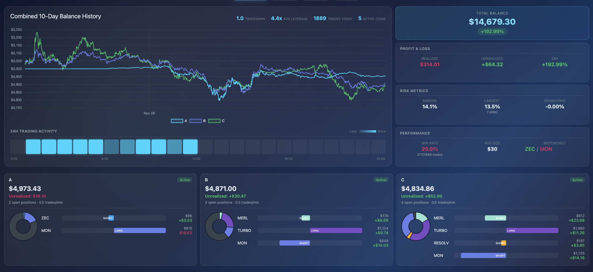

# CopyScalper

A high-performance copy trading bot for Hyperliquid DEX with real-time dashboard.



## Features

- **Real-time copy trading** via WebSocket fill detection
- **Multi-account support** with independent tracking
- **Smart position sizing** based on balance ratios
- **Position drift sync** to maintain alignment with tracked wallets
- **Web dashboard** with live metrics, charts, and activity heatmap
- **Telegram notifications** (optional)

## Quick Start

```bash
npm install
cp .env.example .env  # Configure your wallets and keys
npm start
```

## Dashboard

Access at `http://localhost:3000` - includes:
- Combined balance history across accounts
- Real-time P&L tracking (realized/unrealized)
- Position allocation pie charts
- 24h trading activity heatmap
- Risk metrics (margin, drawdown, leverage)

## Configuration

```env
TRACKED_WALLET=0x...
USER_WALLET=0x...
PRIVATE_KEY=0x...
MIN_ORDER_VALUE=10
```

## License

ISC
